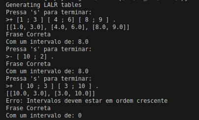

# TPC1 :  Linguagem para Escrita de Intervalos Numéricos -- Validador de Continuidade


**Nome:** Gonçalo Araújo Brandão


**ID:** pg57874


## Descrição


Neste primeiro trabalho de casa tínhamos de criar uma linguagem para uma sequência de intervalos crescentes ou decrescentes e calcular o seu intervalo, a partir da gramática exemplo lecionada nas aulas


## Lex


Utilizamos a biblioteca ***lex*** para identificar a parte lexical da linguagem, identificando os seguintes tokens, sendo estes caracteres terminais e não terminais.


| Token          | Expressão Regular  | Descrição                     |
|----------------|--------------------|-------------------------------|
| NUM            | `\d+(\.\d+)?`      | Números inteiros ou decimais  |
| PONTO_VIRGULA  | `;`                | Ponto e vírgula               |
| MAIS           | `\+`               | Sinal de adição               |
| MENOS          | `\-`               | Sinal de subtração            |
| PONTO          | `\.`               | Ponto                         |
| PRETO_ABRIR    | `\[`               | Parêntese reto para abrir     |
| PRETO_FECHAR   | `\]`               | Parêntese reto para fechar    |


## Yacc
### Sintaxe
Com a biblioteca yacc definimos a nossa gramática de forma a garantirmos uma sintaxe correta. Utilizamos a recursividade à direita. Também, derivamos a expressão sinal da gramática sugerida pelos professores, para MAIS e MENOS, garantindo assim que na parte da definição da semântica mão iremos utilizar If's para perceber que tipo de sinal se tratava.


**Z** → `Sentence` `$`


**Sentence** → `MAIS` `Intervals` `PONTO` 

**Sentence** → `MENOS` `Intervals` `PONTO`


**Intervals** → `Interval` `RemainingIntervals`


**RemainingIntervals** → `Interval` `RemainingIntervals` 

**RemainingIntervals** → `ε`


**Interval** → `PRETO_ABRIR` `NUM` `PONTO_VIRGULA` `NUM` `PRETO_FECHAR` 


### Semântica


Para a aplicação da Semântica na nossa linguagem realizamos regras para:


**Sentence** → `MAIS` `Intervals` `PONTO` 

**Sentence** → `MENOS` `Intervals` `PONTO`


Onde inicialmente convertemos os ***Intervals*** para uma **Lista**. Percorremos essas mesma lista dividindo os intervalos pelo split por ***;*** e convertendo esses valores para float.


Com esta lista de intervalos em floats, comparamos os intervalos percebendo se estão de ordem crescente ou decrescente consoante a regra que estamos a aplicar.


Após a confirmação que os intervalos estão bem ordenados guardamos os valores da diferença entre o primeiro e o último elemento da lista numa variável global de forma a guardamos os nossos resultados e apresentamo-los no final.


## Como Executar


```
python3 tpc1_yacc.py
```

## Resultados




